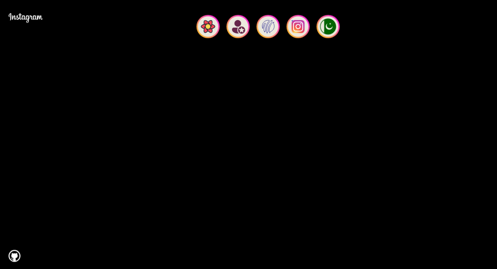
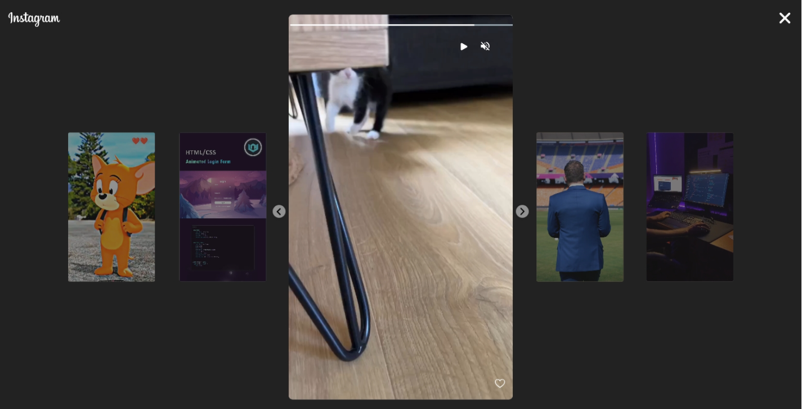
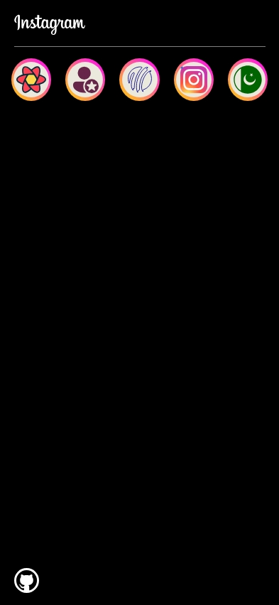

<a name="readme-top"></a>

<!-- PROJECT LOGO -->
<br />
  <div align="center">
    <a href="https://github.com/kzmfhm/instagram-stories.git">
      
    </a>
    <h1 align="center">Refactored by @kzm</h1>
    <p align="center">
    <br/>Instagram's video player is the cool tool that makes your videos pop on the platform. With autoplay and sound controls, have fun with the simplicity and awesomeness animation of the video player! 📹✨
    <br/>
    Built by: @kzm
    <br/>
      <a href="https://github.com/kzmfhm/instagram-stories"><strong>Explore the docs »</strong></a>
      <br/>
     </p>
  </div>

## About The Project

### Photos








  <p align="right"><a href="#readme-top">back to top</a></p>
  
  ### Built With
  
  
  
  
  
  [](https://tailwindcss.com/)

  <p align="right"><a href="#readme-top">back to top</a></p>
  
  ### Description
  
"Step into the world of Instagram Story Viewer—a chic, responsive video player that effortlessly glides with a swipe or click. Immerse yourself in a seamlessly delightful viewing experience, whether you're on your mobile device or desktop. Your appreciation means a lot!🌟
<br/>
If you're enjoying the magic as much as I do, I'd be over the moon if you'd consider adding a little sparkle to my day by giving it a star! 🌟"

<h3>TL;DR</h3>
Feel free to fork this repo for your own purposes, provided you give me credit.

  <p align="right"><a href="#readme-top">back to top</a></p>

<!-- GETTING STARTED -->

## Getting Started

To get a local copy up and running follow these simple example steps.

### Prerequisites

- npm
  ```sh
  npm install npm@latest -g
  ```

### Installation

1. Clone the repo
   ```sh
   git clone https://github.com/kzmfhm/instagram-stories.git
   ```
2. Install NPM packages
   ```sh
   npm install
   ```
3. This is a [Next.js](https://nextjs.org/) project bootstrapped with [`create-next-app`](https://github.com/vercel/next.js/tree/canary/packages/create-next-app).

## Getting Started

First, run the development server:

```bash
npm run dev
# or
yarn dev
# or
pnpm dev
```

Open [http://localhost:3000](http://localhost:3000) with your browser to see the result.

You can start editing the page by modifying `app/page.tsx`. The page auto-updates as you edit the file.

This project uses [`next/font`](https://nextjs.org/docs/basic-features/font-optimization) to automatically optimize and load Inter, a custom Google Font.

## Learn More

To learn more about Next.js, take a look at the following resources:

- [Next.js Documentation](https://nextjs.org/docs) - learn about Next.js features and API.
- [Learn Next.js](https://nextjs.org/learn) - an interactive Next.js tutorial.

You can check out [the Next.js GitHub repository](https://github.com/vercel/next.js/) - your feedback and contributions are welcome!

## Deploy on Vercel

The easiest way to deploy your Next.js app is to use the [Vercel Platform](https://vercel.com/new?utm_medium=default-template&filter=next.js&utm_source=create-next-app&utm_campaign=create-next-app-readme) from the creators of Next.js.

Check out our [Next.js deployment documentation](https://nextjs.org/docs/deployment) for more details. -->

<p align="right"><a href="#readme-top">back to top</a></p>

<!-- QUESTIONS -->

## Questions

If you have any inquiries, don't hesitate to reach out to me via socials or by sending an email from my contact page.
<a href="https://www.linkedin.com/in/khuzaima-n-658b98268/">LinkedIn</a> | <a href="https://github.com/kzmfhm">GitHub</a><br/>
Project Link: [https://github.com/kzmfhm/instagram-stories.git](https://github.com/kzmfhm/instagram-stories.git)

<p align="right"><a href="#readme-top">back to top</a></p>
